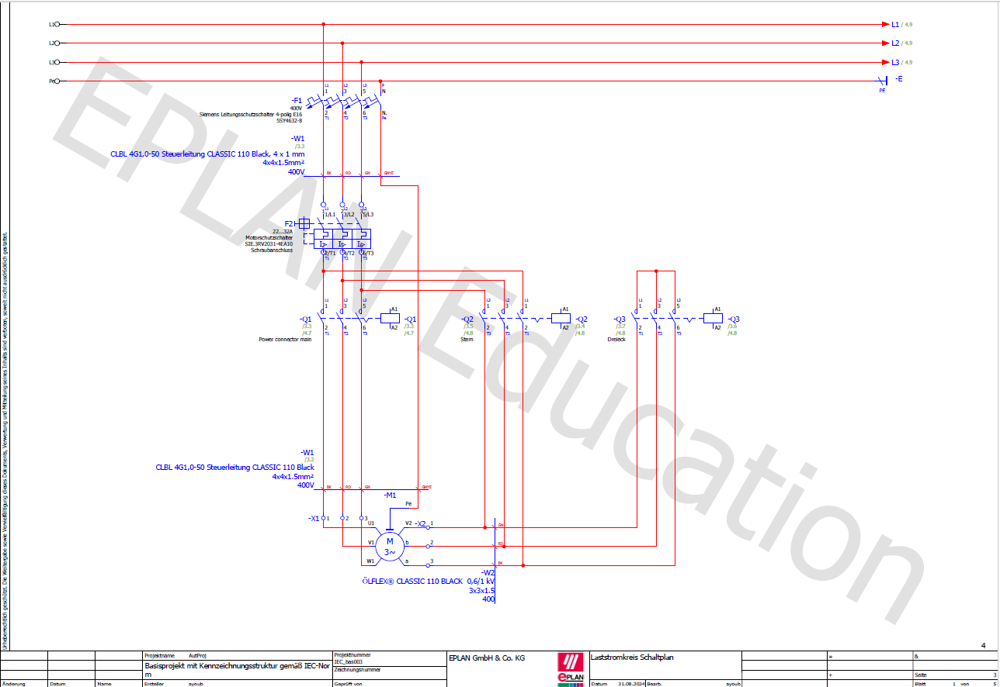
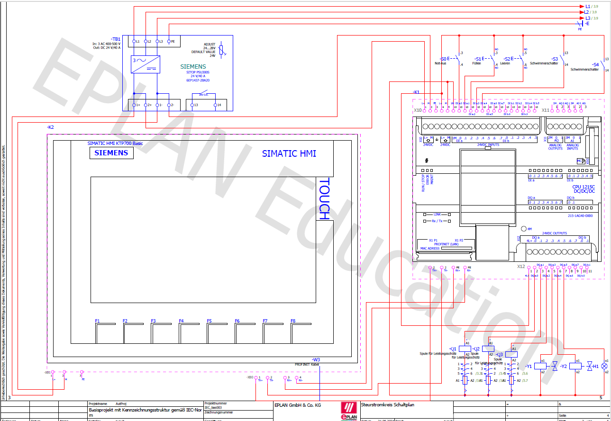
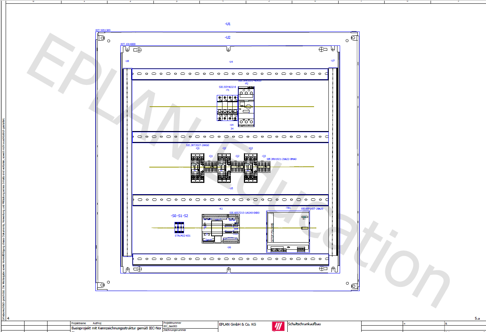
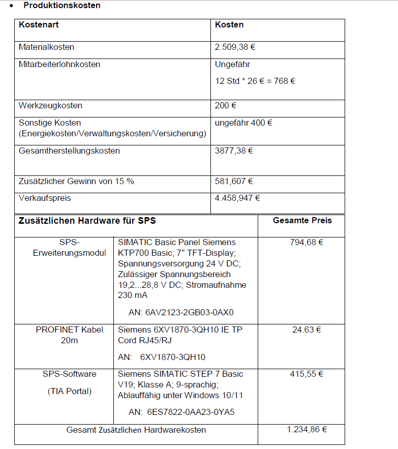

# Automatisierung eines Sammelbeckens

Dieses Projekt wurde im Rahmen eines Hochschulprojekts im Team (2 Personen) entwickelt und umfasst die Planung, Programmierung und Umsetzung eines automatisierten Sammelbecken-Systems.

---

### Meine Aufgaben

* Entwicklung der SPS-Logik in Siemens TIA Portal (SCL)
* Umsetzung der Steuerung für Füll- und Entleerprozesse
* Implementierung der Motorsteuerung (Stern-Dreieck)
* Erstellung der HMI-Visualisierung
* Elektroplanung und Schaltplanerstellung mit EPLAN Electric P8
* Analyse und Test des Systems unter realitätsnahen Bedingungen

---

### Systemübersicht

Das System steuert ein Sammelbecken mithilfe von Sensoren zur Füllstandserkennung sowie Ventilen und einem Motor zur Regelung des Wasserflusses.

Funktionen:

* Automatisches Befüllen und Entleeren
* Zustandsüberwachung über HMI
* Motorsteuerung mit Stern-Dreieck-Umschaltung
* Sicherheitslogik für den Betrieb

---

### EPLAN – Leistungsteil

Darstellung des Leistungsstromkreises inklusive Motoransteuerung und Schutzkomponenten.

---

### EPLAN – Steuerung & HMI

Integration von SPS (Siemens S7-1200), HMI und Ein-/Ausgangssignalen.

---

### Schaltschrankaufbau

Mechanischer Aufbau und Anordnung der Komponenten im Schaltschrank.

---

### HMI Visualisierung

Simulation (TIA Portal):

Reales System:

---

### Code (Auszug)

Ablaufsteuerung des Systems im Hauptprogramm.

Motorsteuerung mit Stern-Dreieck-Umschaltung.

---

### Dokumentation

#### EPLAN Schaltplan

[PDF öffnen](docs/EPLAN%20Schaltplan.pdf)

Übersicht über den vollständigen elektrischen Aufbau und die Verdrahtung.

---

#### Stückliste (BOM)

[PDF öffnen](docs/bill_of_materials.pdf)

Alle verwendeten Komponenten und Materialien im System.

---

#### Produktionskosten

[PDF öffnen](docs/Produktionskosten.pdf)

Kalkulation der Material- und Herstellungskosten.

---

### Hinweis

Dieses Repository zeigt die wesentlichen Bestandteile des Projekts.
Der vollständige SPS-Code ist projektbedingt nicht vollständig enthalten.

---

### Autor

Ayoub Khichi
Elektrotechnik (B. Eng.)
Hochschule Koblenz
