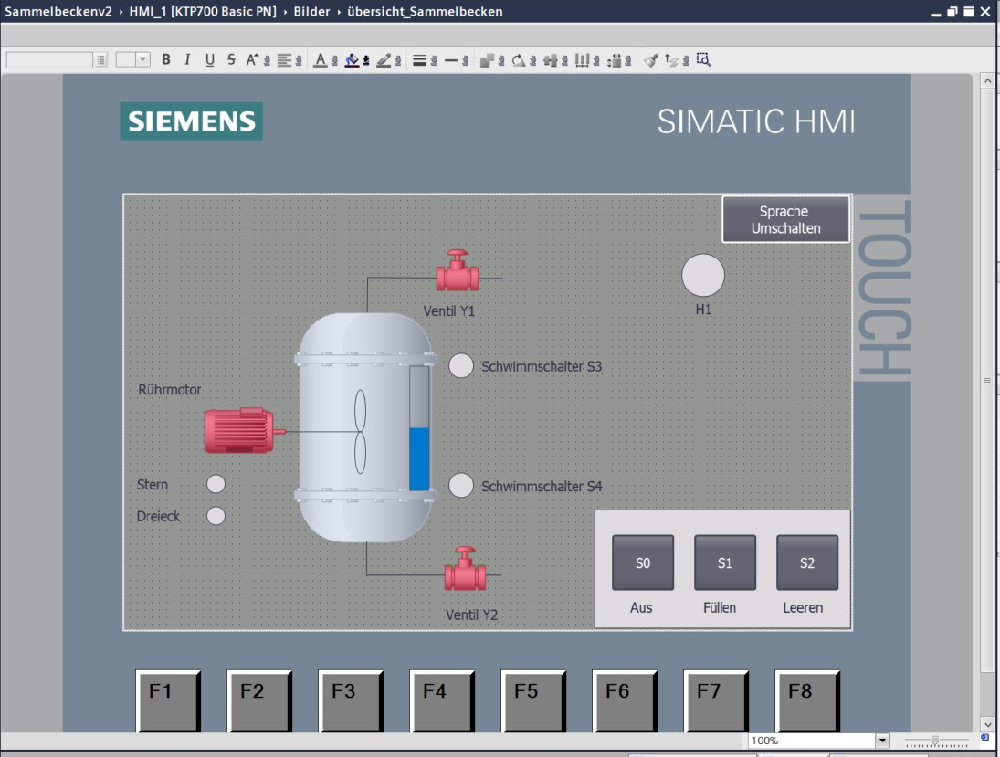
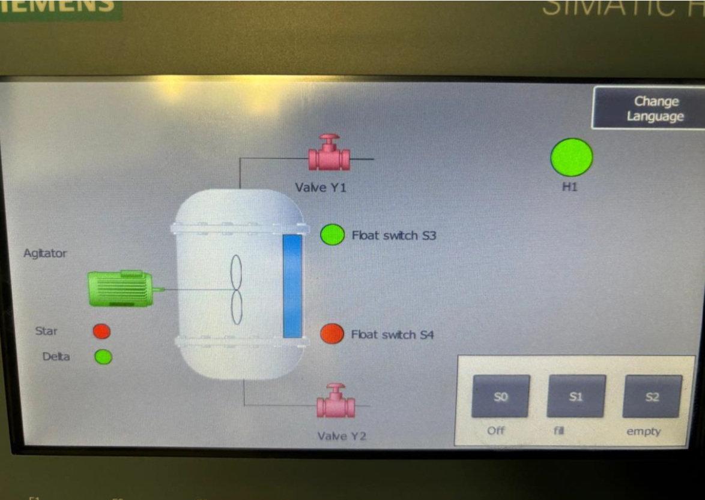
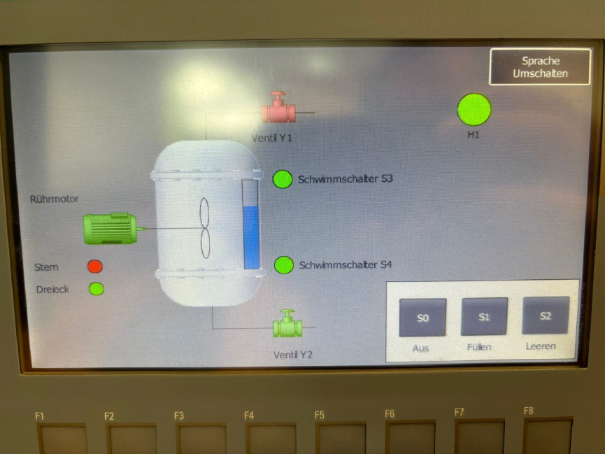
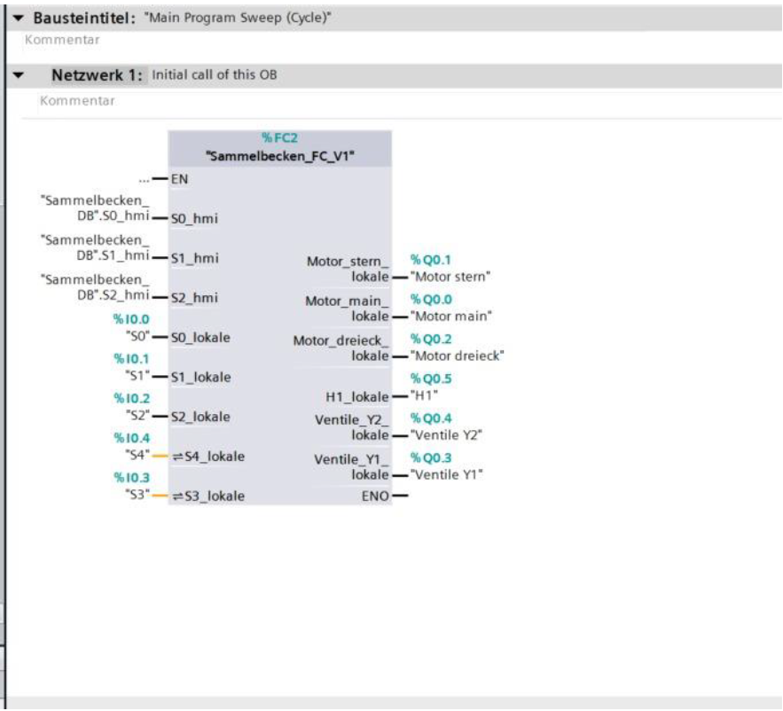
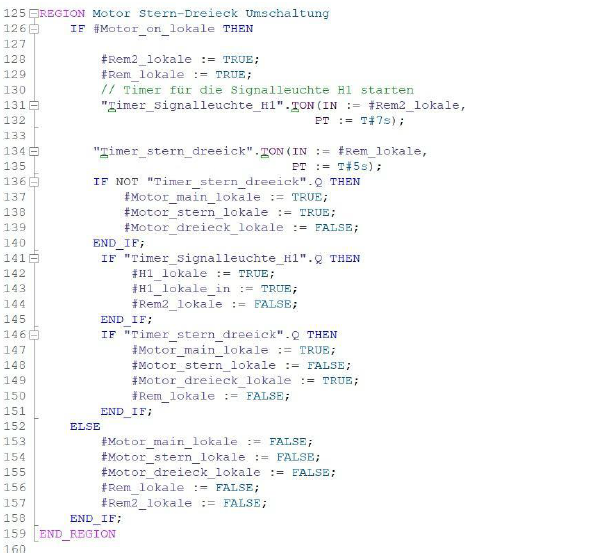

# Automatisierung eines Sammelbeckens

Dieses Projekt wurde im Rahmen eines Hochschulprojekts im Team (2 Personen) entwickelt und umfasst die Planung, Programmierung und Umsetzung eines automatisierten Sammelbecken-Systems.

---

### Meine Aufgaben

* Entwicklung der SPS-Logik in Siemens TIA Portal (SCL)
* Umsetzung der Steuerung für Füll- und Entleerprozesse
* Implementierung der Motorsteuerung (Stern-Dreieck)
* Erstellung der HMI-Visualisierung
* **Elektroplanung und Schaltplanerstellung mit EPLAN Electric P8**
* Analyse und Test des Systems unter realitätsnahen Bedingungen

---

### Systembeschreibung

Das System steuert ein Sammelbecken mithilfe von Sensoren zur Füllstandserkennung sowie Ventilen und einem Motor zur Regelung des Wasserflusses.

Die Steuerung umfasst:

* Automatisches Befüllen und Entleeren
* Zustandsüberwachung über HMI
* Motorsteuerung mit Stern-Dreieck-Umschaltung
* Sicherheitslogik für den Betrieb

---

### Technologien

* Siemens TIA Portal (S7, SCL)
* HMI (Siemens Panel)
* EPLAN Electric P8

---

### HMI Visualisierung

**Simulation (TIA Portal):**

**Reales System (Siemens HMI):**

---

### Code (Auszug)

Hauptprogramm (OB) zur Ablaufsteuerung des Systems.

Umsetzung der Motorsteuerung mit Stern-Dreieck-Umschaltung.

---

### Dokumentation

* [EPLAN Schaltplan](docs/EPLAN%20Schaltplan.pdf)
  Vollständiger elektrischer Schaltplan des Systems inklusive Verdrahtung und Komponenten.
[PDF öffnen](docs/EPLAN%20Schaltplan.pdf)

* [Stückliste (BOM)](docs/bill_of_materials.pdf)
  Übersicht aller verwendeten Bauteile und Komponenten.

* [Produktionskosten](docs/Produktionskosten.pdf)
  Kalkulation der Material- und Herstellungskosten.

---

### Hinweis

Dieses Repository zeigt die wesentlichen Bestandteile des Projekts.
Der vollständige SPS-Code ist projektbedingt nicht vollständig enthalten.

---

### Autor

Ayoub Khichi
Elektrotechnik (B. Eng.)
Hochschule Koblenz
